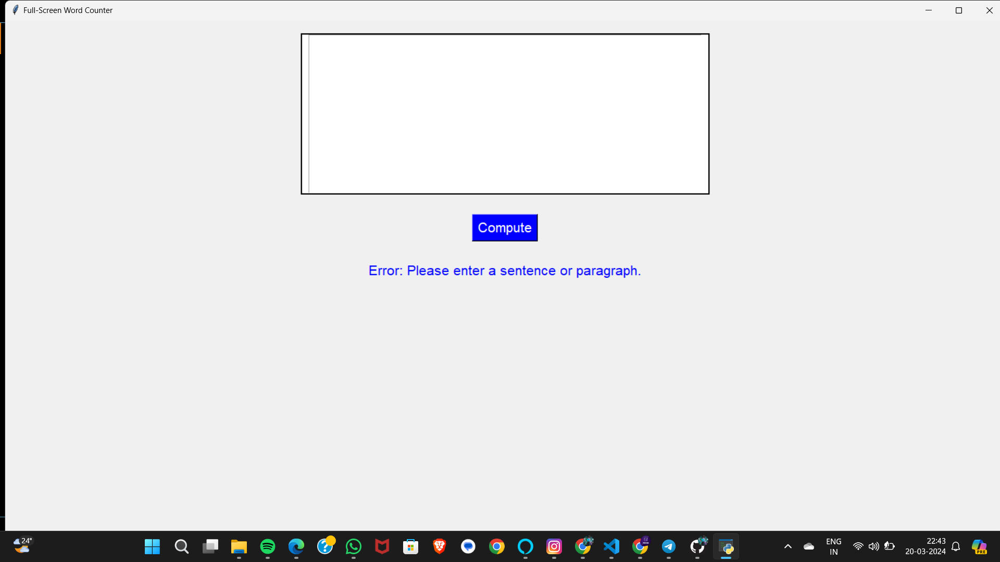
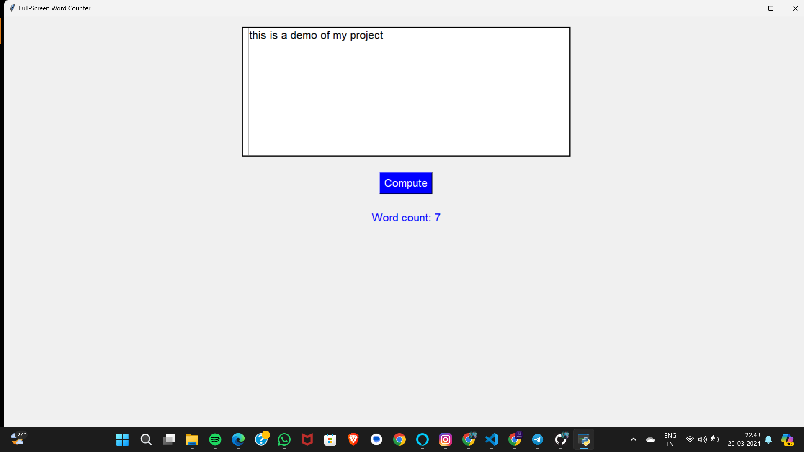

# Word Counter Application with Tkinter GUI

This Python application utilizes the Tkinter library to create a graphical user interface (GUI) for counting words in a given text input. The user can enter text into the input box, and upon clicking the "Compute" button, the application calculates the number of words in the input text and displays the result.

## Features:

- Counts the number of words in the input text.
- Error handling for empty input.
- Responsive GUI with fullscreen support.

## Screenshots:

*Screenshot 1: Word Counter Application - Initial State*

*Screenshot 2: Word Counter Application - Input Text and Result*

## How to Use:

1. Clone the repository or download the source code files.
2. Ensure you have Python installed on your system.
3. Install the required libraries (`tkinter` is usually included with Python).
4. Run the `word_counter.py` script.
5. Enter text into the input box.
6. Click the "Compute" button to calculate the word count.
7. View the result displayed below the input box.

## File Structure:

- `word_counter.py`: Main Python script containing the application logic.
- `README.md`: This file, providing information about the application.
- `screenshot1.png`: Screenshot of the application's initial state.
- `screenshot2.png`: Screenshot of the application with input text and result.

## Dependencies:

- Python 3.x
- Tkinter (Usually included with Python)

## Contributions:

Contributions are welcome! Feel free to submit issues or pull requests.

## License:

This project is licensed under the MIT License. See the [LICENSE](LICENSE) file for details.
